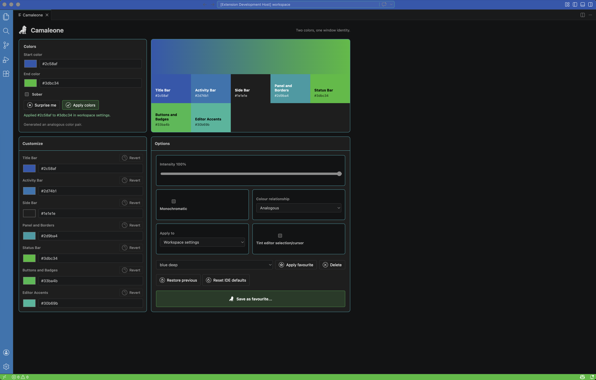
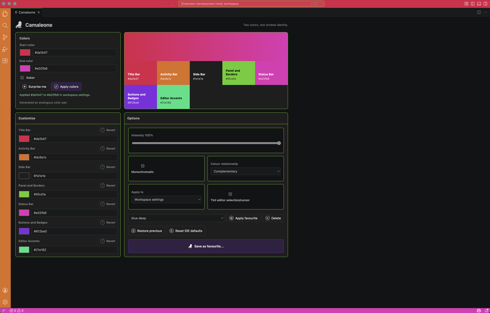
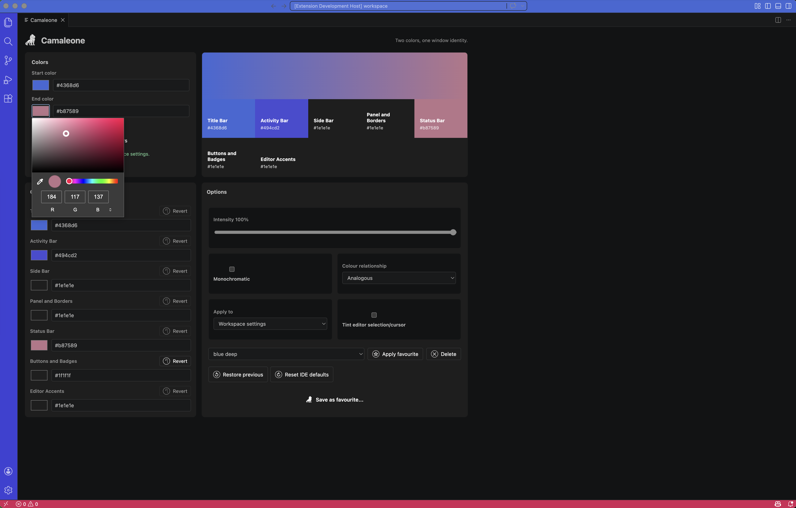
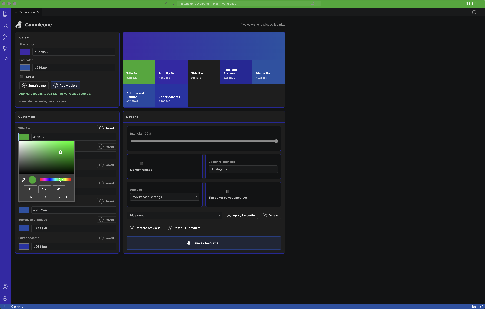
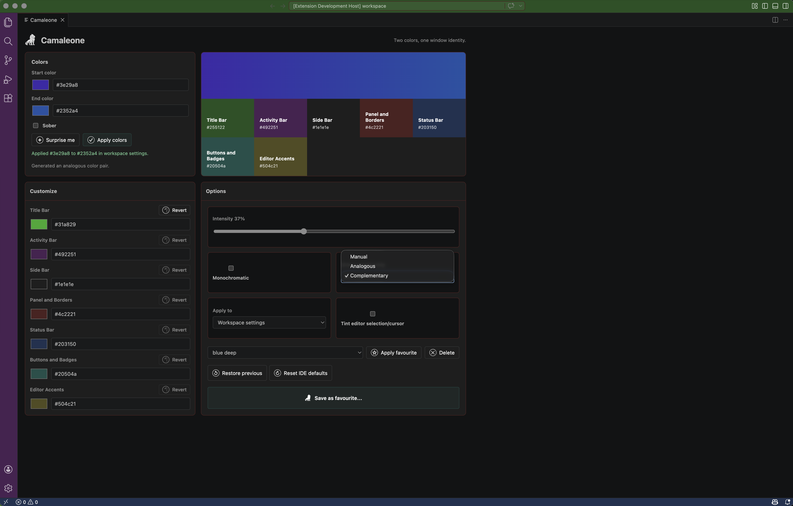
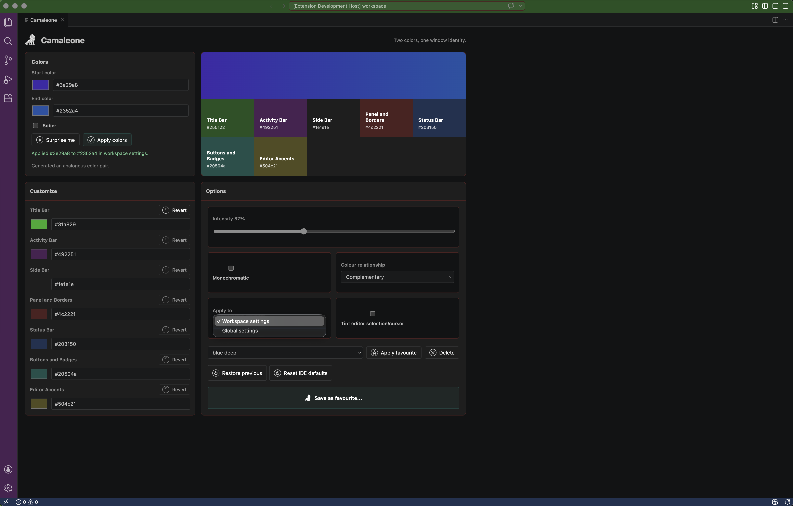
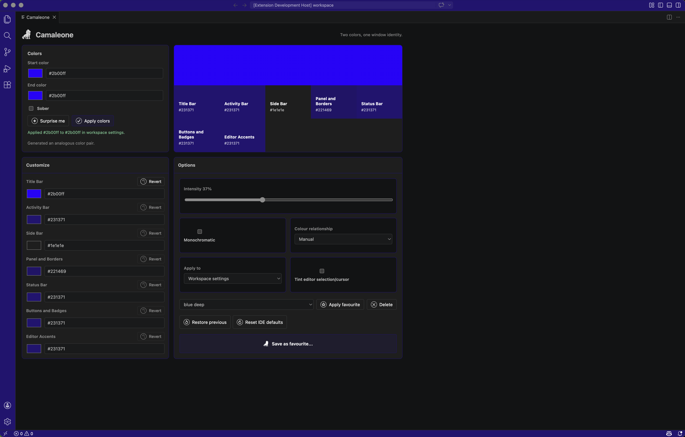
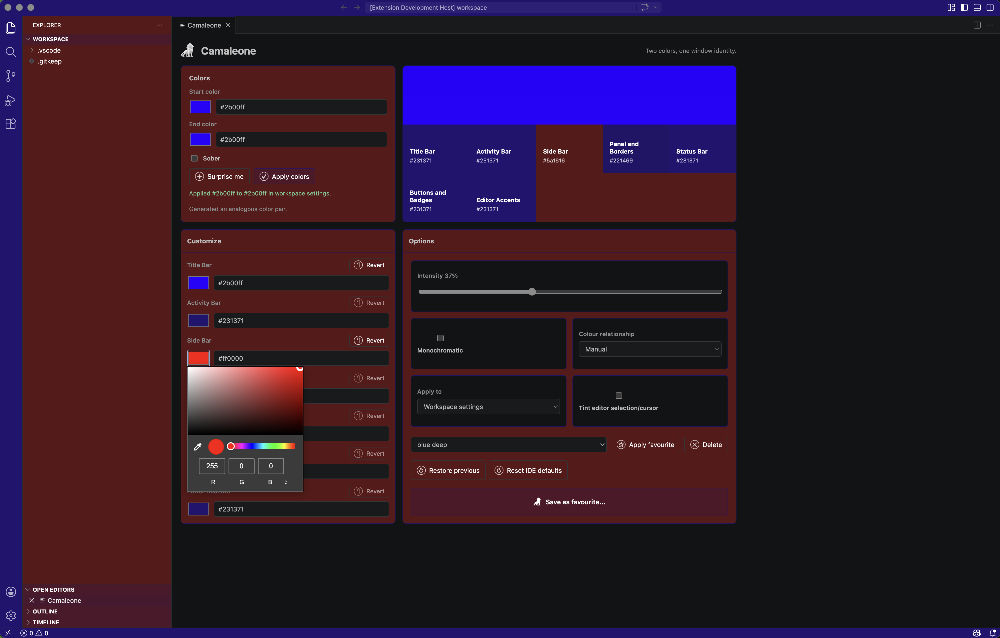

# Camaleone

Camaleone is a VS Code and Cursor extension that gives each window a two-color identity, similar in spirit to Peacock but with a gradient-inspired treatment.

VS Code's supported workbench color API accepts individual color values, not literal CSS gradients on the main app chrome. Camaleone samples a start-to-end gradient and applies those samples across the title bar, activity bar, side bar, panel, status bar, buttons, borders, and optional editor accents.

## Marketplace Description

Camaleone gives every VS Code and Cursor window a distinct two-color identity without forcing you to install a full theme. Pick a start and end color, generate palettes with `Surprise me`, keep the result restrained with default `Sober` mode, or customize individual surfaces such as the title bar, activity bar, side bar, panel, status bar, buttons, and editor accents.

It is built for people who work across many projects and want a fast visual cue for each window. Save favourite palettes, apply them again later, restore the colors Camaleone replaced, or reset cleanly to IDE defaults whenever you need to.

> "It's way better than other solutions like Peacock."

## How To Use

1. Install Camaleone in VS Code or Cursor.
2. Open the Command Palette with `Cmd+Shift+P` on macOS or `Ctrl+Shift+P` on Windows and Linux.
3. Run `Camaleone: Open Color Picker`.
4. Choose a `Start color` and `End color`, or click `Surprise me` to generate a palette.
5. Leave `Sober` enabled for a restrained window identity, or turn it off for a fuller palette across the workbench.
6. Choose whether to apply the colors to `Workspace settings` or `Global settings`.
7. Use `Customize` to tune individual surfaces such as the title bar, activity bar, side bar, panel, status bar, buttons, and editor accents. Surface changes apply automatically; `Revert` returns a surface to the generated palette color.
8. Click `Apply colors` to write the current palette.
9. Click `Save as favourite...` to store a palette, then choose it from the favourites list to apply it later.
10. Use `Restore previous` to return to the colors Camaleone replaced, or `Reset IDE defaults` to remove Camaleone-managed colors.

## Default Favourites

Camaleone ships with default favourites for the Magnificent 7 companies and the QS 2026 top 10 universities. These presets are brand-inspired two-color profiles, so they fit Camaleone's workbench model while keeping the names recognizable.

- Magnificent 7: Apple, Microsoft, Alphabet, Amazon, Meta, NVIDIA (`#76b900`), and Tesla.
- QS 2026 top 10 universities: Massachusetts Institute of Technology (MIT), Imperial College London, Stanford University (`#8c1515` and `#dad7cb`), University of Oxford, Harvard University, University of Cambridge, ETH Zurich, National University of Singapore (NUS), UCL, and California Institute of Technology (Caltech).
- To edit a preloaded favourite, choose it from the favourites list, adjust the colors or custom surfaces, then click `Save as favourite...`. The save prompt is prefilled with the preset name, and saving creates your editable override.

## Local Development

1. Open this folder in VS Code or Cursor.
2. Press `F5` and choose the `Run Extension` launch configuration. This starts a clean Extension Development Host with a separate user-data directory and an empty extensions directory, so unrelated installed extensions cannot crash the test window.
3. In the Extension Development Host, run `Camaleone: Open Color Picker`.
4. Choose a start color, end color, intensity, colour relationship, whether to write workspace or global settings, and any per-surface tweaks.
5. Click `Apply colors`.

If the editor reports a GPU startup problem from another extension or from the host runtime, run `Camaleone: Quick Apply Without Webview` instead. It uses native VS Code input boxes and does not open the preview webview.

The errors `nvidia-smi: command not found` and `Could not find GPU with index 0 make sure you have a GPU available` come from the installed `maimonator.gpu-monitor` extension, not Camaleone. This workspace sets `gpu-monitor.binaryPath` to a harmless no-GPU response in `.vscode/settings.json` so opening the project with `code .` does not trigger that startup failure on macOS. The `Run Extension` launch profile also isolates the dev host with an empty extensions directory instead of the global `--disable-extensions` flag, so the editor should not show the "All installed extensions are temporarily disabled" banner.

Warnings such as `DEP0040` for `punycode` or `ExperimentalWarning: SQLite is an experimental feature` are emitted by the VS Code/Cursor host process or bundled editor services, not by Camaleone. Camaleone has no runtime dependencies and does not import `punycode` or SQLite. The launch profile intentionally does not set `NODE_NO_WARNINGS` or `--no-warnings`, so warnings remain visible while extension-specific failures can still be fixed directly.

## Commands

- `Camaleone: Open Color Picker`
- `Camaleone: Quick Apply Without Webview`
- `Camaleone: Apply Configured Colors`
- `Camaleone: Restore Previous Colors`
- `Camaleone: Reset to IDE Defaults`
- `Camaleone: Surprise Me`
- `Camaleone: Save Current Colors as Favourite`
- `Camaleone: Apply Favourite Colors`

## Icons

- Marketplace icon: `assets/icons/store/camaleone.png`
- Source PNGs: `assets/icons/png/`
- ICO exports: `assets/icons/ico/`

## Marketplace Screenshots










## Settings

- `camaleone.startColor`
- `camaleone.endColor`
- `camaleone.intensity`
- `camaleone.applyTo`
- `camaleone.includeEditorAccent`
- `camaleone.sober`
- `camaleone.colorRelationship`
- `camaleone.surfaceOverrides`
- `camaleone.persistChoices`

## Notes

- Workspace mode writes generated `workbench.colorCustomizations` to `.vscode/settings.json`.
- Global mode writes generated `workbench.colorCustomizations` to your user settings.
- Sober mode is on by default, keeping most surfaces neutral while tinting the title bar, activity bar, and status bar.
- Manual is the default colour relationship, with a tighter title/activity/panel ramp before the end color reaches the status bar.
- In sober mode the side bar stays at `#1e1e1e`; outside sober mode the side bar gets a translucent sampled color so Explorer contents stay readable.
- The extension does not use CUDA, Metal, WebGPU, or any GPU runtime. By default, applying a gradient only persists the generated workbench colors; set `camaleone.persistChoices` to `true` if you also want the chosen gradient values written into settings.
- Clearing restores color values that existed before this extension first applied its generated colors for that target. If you manually edit one of those same color keys after applying, clearing leaves your manual edit in place.
- Reset to default removes Camaleone-managed color customizations from workspace and user settings so the IDE falls back to the active light or dark theme. The removed Camaleone colors stay available through `Restore Previous`.
- Cursor uses the VS Code extension API, so the same extension can run there.

## Validate

```sh
npm test
```
