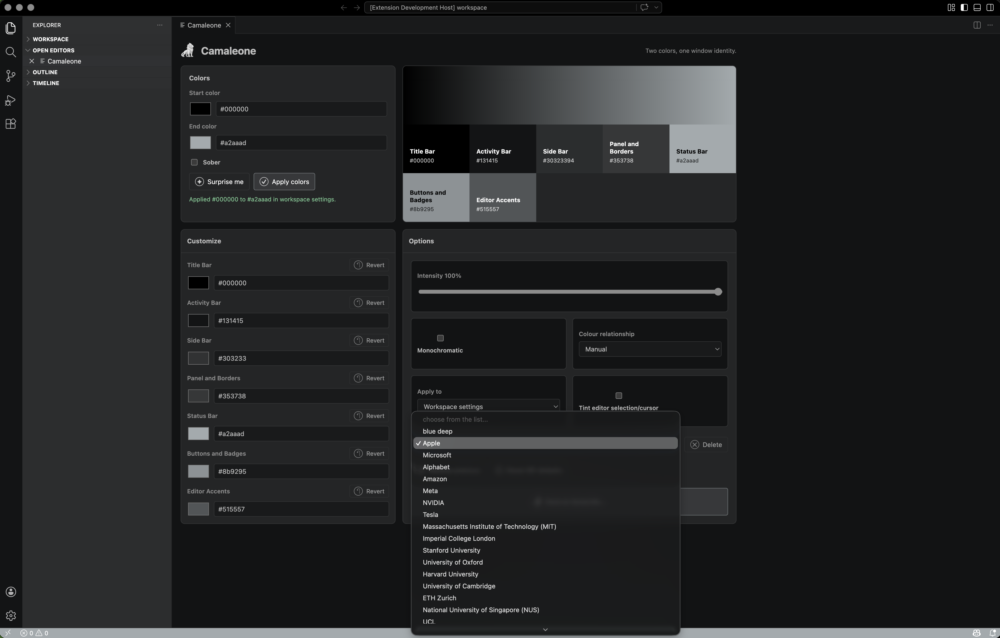
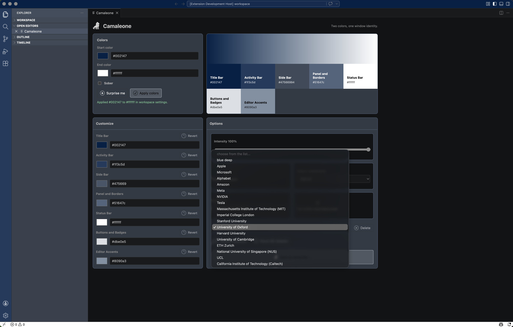

# Camaleone

Camaleone is a VS Code and Cursor extension that gives each window more personality, with gradient-inspired treatment, high customization, and presets with the colours of Magnificent 7 companies and the top 10 universities in the world.

VS Code's supported workbench color API accepts individual color values. Camaleone samples a start-to-end gradient and applies those samples across the title bar, activity bar, side bar, panel, status bar, buttons, borders, and optional editor accents.

## Marketplace Description

Camaleone gives every VS Code and Cursor window a distinct identity **without forcing you to install a full theme**.

Pick a start and end color, generate palettes with `Surprise me`, keep the result restrained with default `Sober` mode, use presets, or customize individual surfaces such as the title bar, activity bar, side bar, panel, status bar, buttons, and editor accents.

It is built for people who work across many projects and want a fast visual cue for each window. Save favourite palettes, apply them again later, restore the colors Camaleone replaced, or reset cleanly to IDE defaults whenever you need to.

> "It's way better than other solutions like Peacock."

## Marketplace Screenshots

|  |  |  |  |  |
| --- | --- | --- | --- | --- |
|  |  |  |  |  |
|  |  |  |  |  |

## How To Use

1. Install Camaleone in VS Code or Cursor.
2. Open the Command Palette with `Cmd+Shift+P` on macOS or `Ctrl+Shift+P` on Windows and Linux.
3. Run `Camaleone: Open Color Picker`.
4. Choose a `Start color` and `End color`, or click `Surprise me` to generate a palette.
5. Leave `Sober` enabled for a restrained window identity, or turn it off for a fuller palette across the workbench.
6. Choose whether to apply the colors to `Workspace settings` or `Global settings`.
7. Use `Customize` to tune individual surfaces such as the title bar, activity bar, side bar, panel, status bar, buttons, and editor accents. Surface changes apply automatically; `Revert` returns a surface to the generated palette color.
8. Click `Apply colors` to write the current palette.
9. Click `Save as favourite...` to store a palette, then choose it from the favourites list to apply it later. Preloaded presets can also be loaded and customized.
10. Use `Restore previous` to return to the colors Camaleone replaced, or `Reset IDE defaults` to remove Camaleone-managed colors.

## Preloaded Favourites

Camaleone ships with default favourites for the Magnificent 7 companies and the QS 2026 top 10 universities. These presets are brand-inspired two-color profiles, so they fit Camaleone's workbench model while keeping the names recognizable.

- Magnificent 7: Apple, Microsoft, Alphabet, Amazon, Meta, NVIDIA (`#76b900`), and Tesla.
- QS 2026 top 10 universities: Massachusetts Institute of Technology (MIT), Imperial College London, Stanford University (`#8c1515` and `#dad7cb`), University of Oxford, Harvard University, University of Cambridge, ETH Zurich, National University of Singapore (NUS), UCL, and California Institute of Technology (Caltech).
- To edit a preloaded favourite, choose it from the favourites list, adjust the colors or custom surfaces, then click `Save as favourite...`. The save prompt is prefilled with the preset name, and saving creates your editable override.

## Commands

- `Camaleone: Open Color Picker`
- `Camaleone: Quick Apply Without Webview`
- `Camaleone: Apply Configured Colors`
- `Camaleone: Restore Previous Colors`
- `Camaleone: Reset to IDE Defaults`
- `Camaleone: Surprise Me`
- `Camaleone: Save Current Colors as Favourite`
- `Camaleone: Apply Favourite Colors`

## Icons

- Marketplace icon: `assets/icons/ico/camaleone_transparent.ico`
- Source PNGs: `assets/icons/png/`
- ICO exports: `assets/icons/ico/`

## Settings

Camaleone can be driven from the picker UI or directly from VS Code settings:

- `camaleone.startColor`: start color for generated palettes.
- `camaleone.endColor`: end color for generated palettes.
- `camaleone.intensity`: blend strength from `0` to `100`.
- `camaleone.applyTo`: write colors to `workspace` or `global` settings.
- `camaleone.includeEditorAccent`: also tint editor accents such as cursor, selection, links, and line highlight.
- `camaleone.monochromatic`: derive panel colors from the start color instead of a straight two-color ramp.
- `camaleone.sober`: keep most surfaces neutral while tinting the title bar, activity bar, and status bar.
- `camaleone.colorRelationship`: choose `manual`, `analogous`, or `complementary` palette movement.
- `camaleone.panelHarmony`: legacy harmony rule used when monochromatic mode is enabled.
- `camaleone.surfaceOverrides`: per-surface color overrides keyed by surface id.
- `camaleone.persistChoices`: persist the last chosen gradient inputs as extension settings. This is disabled by default, so applying colors only writes the generated `workbench.colorCustomizations`.

## Customization Notes

- Workspace mode writes generated colors into the current workspace settings. Global mode writes them into user settings for every window.
- `Sober` mode is on by default. It keeps most managed workbench surfaces at `#1e1e1e` while applying the chosen identity to the title bar, activity bar, and status bar.
- In sober mode the side bar stays at `#1e1e1e` unless you customize it. Outside sober mode, the side bar receives a translucent sampled color so Explorer contents stay readable.
- Surface colors changed in `Customize` apply immediately. The `Revert` button returns that surface to the generated color from the current start/end palette.
- Saving over a preloaded favourite name creates an editable override. It does not mutate the bundled preset in the extension package.
- `Restore previous` restores color values that existed before Camaleone first applied its managed colors for that target. `Reset IDE defaults` removes Camaleone-managed color customizations so the active VS Code or Cursor theme takes over again.
